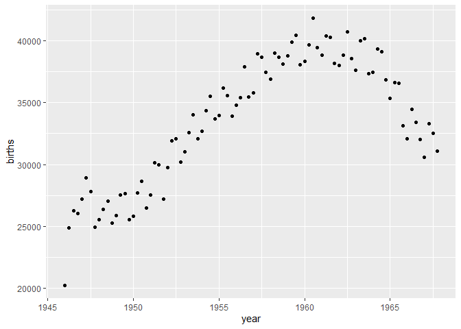
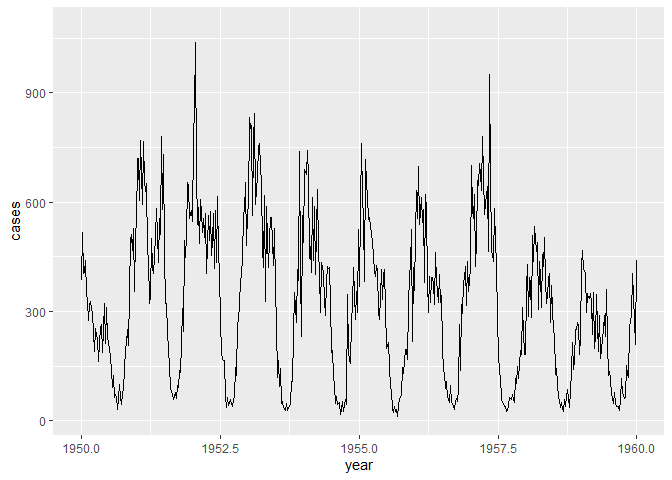
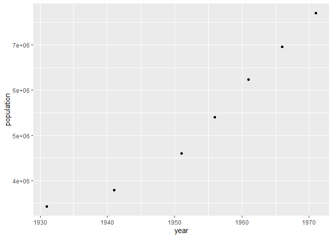
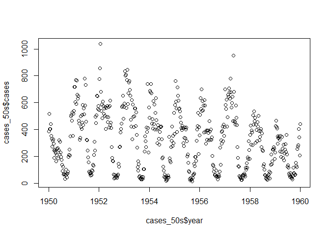
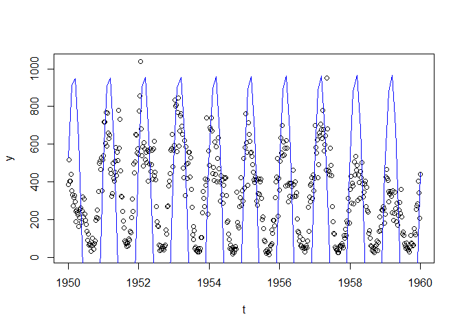

``` r
library(tidyverse)
```

    ## -- Attaching packages --------------------------------------- tidyverse 1.3.1 --

    ## v ggplot2 3.3.4     v purrr   0.3.4
    ## v tibble  3.1.2     v dplyr   1.0.7
    ## v tidyr   1.1.3     v stringr 1.4.0
    ## v readr   1.4.0     v forcats 0.5.1

    ## -- Conflicts ------------------------------------------ tidyverse_conflicts() --
    ## x dplyr::filter() masks stats::filter()
    ## x dplyr::lag()    masks stats::lag()

### Load data

``` r
births <- read.csv("data/births.csv")
cases <- read.csv("data/chicken_pox_cases.csv")
```

    ## Warning in scan(file = file, what = what, sep = sep, quote = quote, dec = dec, :
    ## embedded nul(s) found in input

``` r
population <- read.csv("data/population.csv")
```

``` r
qplot(year, births, data = births)
```



``` r
ggplot(cases) +
  geom_line(aes(year, cases)) + xlim(1950, 1960)
```

    ## Warning: Removed 962 row(s) containing missing values (geom_path).



``` r
qplot(year, population, data = population)
```



Parameters to be estimated:

-   *α* - birth rate

-   *μ* - mortality rate

-   *b* -

-   *γ* - recovery rate

-   *β*<sub>0</sub> - average infection rate throughout the year

-   *ϵ* - strength of seasonal forcing function

-   *S*<sub>0</sub> - number of susceptible individuals at the start of
    1950

## Fitting the ODE model

### *α* parameter

``` r
births_50s <- births %>% filter(year >= 1950 & year < 1960)
birth <- sum(births_50s$births)/(max(births_50s$year) - min(births_50s$year))
```

### *μ* parameter

``` r
population_50s <- population %>% filter(year >= 1950 & year < 1960)
pop_diff <- (max(population_50s$population) - min(population$population))/(max(population_50s$year) - min(population_50s$year))
death_rate <- pop_diff - birth
```

### *b* parameter

``` r
cases_50s <- cases %>% filter(year >= 1950 & year < 1960)
plot(cases_50s$year, cases_50s$cases)
```



``` r
t <- cases_50s$year
y <- cases_50s$cases

# ssp <- spectrum(y)
# per <- 1/ssp$freq[ssp$spec==max(ssp$spec)]
# reslm <- lm(y ~ sin(2*pi/365*t) +cos(2*pi/365*t))
# summary(reslm)
# 
# rg <- diff(range(y))
# plot(y~t,ylim=c(min(y)-0.1*rg,max(y)+0.1*rg))
# lines(fitted(reslm)~t,col=4,lty=2)

res <- nls(y ~ e*sin((2*pi/365)*t + b), start = list(e = 600, b = 1))
co <- coef(res)

fit <- function(e, x, b) {e*sin((2*pi/1)*x + b)}

pred_cases <- fit(e = co["e"], x = t, b = co["b"])
plot(t, y)
curve(fit(x, e = co["e"], b = co["b"]), col = "blue", add = T)
```



ca
