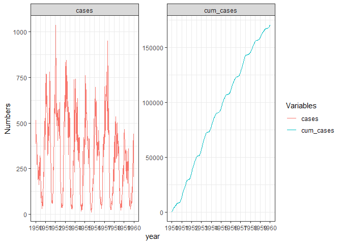

``` r
# restore.session(file = "data_modelling.RSession")
```

``` r
# save.session(file = "data_modelling.RSession")
```

### Load data

``` r
qplot(year, births, data = births)
```


``` r
ggplot(cases) +
  geom_line(aes(year, cases)) + xlim(1950, 1960)
```

    ## Warning: Removed 962 row(s) containing missing values (geom_path).


``` r
qplot(year, population, data = population)
```


Parameters to be estimated:

-   *α* - birth rate

-   *μ* - mortality rate

-   *b* -

-   *γ* - recovery rate

-   *β*<sub>0</sub> - average infection rate throughout the year

-   *ϵ* - strength of seasonal forcing function

-   *S*<sub>0</sub> - number of susceptible individuals at the start of
    1950

## Fitting the ODE model

### *α* parameter

``` r
births_50s <- births %>% filter(year >= 1950 & year < 1960)
birth <- sum(births_50s$births)/(max(births_50s$year) - min(births_50s$year))


births_50s$percapita <- births_50s$births/5001238

alpha <- mean(births_50s$percapita) * 4
```

### *μ* parameter

``` r
population_50s <- population %>% filter(year >= 1950 & year < 1960)
pop_diff <- (max(population_50s$population) - min(population$population))#/(max(population_50s$year) - min(population_50s$year))

death_rate <- pop_diff - birth

births_56 <- births_50s %>% filter(year >= 1951 & year < 1956)

pop_diff - sum(births_56$births)
```

    ## [1] 1328946

``` r
962559/10
```

    ## [1] 96255.9

``` r
mu = -(1328946/(5*mean(population_50s$population)))
```

### *b* parameter

``` r
cases_50s <- cases %>% filter(year >= 1950 & year < 1960)
cases_50s$cum_cases <- cumsum(cases_50s$cases)
plot(cases_50s$year, cases_50s$cases)
```


``` r
p <- cases_50s %>% pivot_longer(cols = c("cases","cum_cases"),
                           names_to = "Variables",
                           values_to = "Numbers") %>%
  ggplot() +
  geom_line(aes(x = year, y = Numbers, col = Variables)) +
  facet_wrap(~Variables, scales = "free") + scale_x_continuous(breaks = seq(1950,1960, by = 1))
p
```



``` r
t <- cases_50s$year
y <- cases_50s$cases

# ssp <- spectrum(y)
# per <- 1/ssp$freq[ssp$spec==max(ssp$spec)]
# reslm <- lm(y ~ sin(2*pi/365*t) +cos(2*pi/365*t))
# summary(reslm)
# 
# rg <- diff(range(y))
# plot(y~t,ylim=c(min(y)-0.1*rg,max(y)+0.1*rg))
# lines(fitted(reslm)~t,col=4,lty=2)

res <- nls(y ~ e*sin((2*pi/365)*t + b), start = list(e = 600, b = .5))
co <- coef(res)

fit <- function(e, x, b) {e*sin((2*pi/1)*x + b)}

pred_cases <- fit(e = co["e"], x = t, b = co["b"])
plot(t, y)
curve(fit(x, e = co["e"], b = co["b"]), col = "blue", add = T)
```


\#\# SIR Running simple SIR model in R

``` r
library(deSolve)
```

1.  Define R function for the general system of equations

``` r
SEI_seasonal = function(time, state, parameters){
  with(as.list(c(state, parameters)),{
    beta <- beta_0 * (1 + epsilon * sin((2 * pi * time/1) +  b))
    
    # defining the equations
    dS <- alpha * (S + I + R) - mu * S - beta * S * I
    dI <- beta * S * I - (gamma + mu) * I
    dR <- gamma * I - mu * R
    res = c(dS, dI, dR)
    # return the list of gradients
    list(res)
  })
}
```

1.  Specify the time points at which we want the integrator to save the
    state of the system
2.  Provide values for the parameters
3.  Give initial values for the all state variables

``` r
times  = seq(1950, 1960, by = 1/10)


SEI_seasonal_pars <- c(
  alpha = 0.02713746,
  mu = 0.0005479452,
  beta_0 = 0.00000001,
  epsilon = 5,
  b = 0.5636866,
  gamma = 0.05
)

S_0 <- 4501114

init <- c(S = S_0, I = 385, R = 1000)
```

1.  Invoke R function to do the integration

``` r
out <- ode(y = init, times = times, func = SEI_seasonal, parms = SEI_seasonal_pars)
out=as.data.frame(out) 
out$IR <- out$I + out$R
head(round(out, 3))
```

    ##     time       S       I        R       IR
    ## 1 1950.0 4501114 385.000 1000.000 1385.000
    ## 2 1950.1 4513094 391.409 1001.885 1393.293
    ## 3 1950.2 4525103 399.973 1003.808 1403.781
    ## 4 1950.3 4537145 407.365 1005.772 1413.138
    ## 5 1950.4 4549224 410.534 1007.764 1418.298
    ## 6 1950.5 4561340 408.063 1009.758 1417.821

``` r
# Plot the output ---------------------------------------------------------
tidy_out <- out %>% pivot_longer(!time, names_to = "variable", values_to = "values") %>% mutate(variable = factor(variable, levels = c("S","I","R","IR"), ordered = T))#%>% filter(variable == "S")

plot <- ggplot(tidy_out) +
  geom_line(mapping = aes(x = time, y = values, color = variable)) + scale_x_continuous(breaks = seq(1950,1960,by = 1)) + facet_wrap(~variable, scales = "free") 

plot
```


