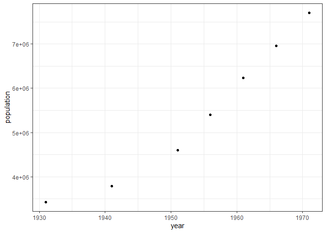

``` r
# restore.session(file = "data_modelling.RSession")
```

``` r
# save.session(file = "data_modelling.RSession")
```

### Load data

``` r
qplot(year, births, data = births)
```


``` r
ggplot(cases) +
  geom_line(aes(year, cases)) + xlim(1950, 1960)
```

    ## Warning: Removed 962 row(s) containing missing values (geom_path).


``` r
qplot(year, population, data = population) + theme_bw()
```



Parameters to be estimated:

-   *α* - birth rate

-   *μ* - mortality rate

-   *b* -

-   *γ* - recovery rate

-   *β*<sub>0</sub> - average infection rate throughout the year

-   *ϵ* - strength of seasonal forcing function

-   *S*<sub>0</sub> - number of susceptible individuals at the start of
    1950

## Fitting the ODE model

### *α* parameter

``` r
population_50s <- population %>% filter(year >= 1950 & year < 1960)
births_50s <- births %>% filter(year >= 1950 & year < 1960)
birth <- sum(births_50s$births)/(max(births_50s$year) - min(births_50s$year))


births_50s$percapita <- births_50s$births/mean(population_50s$population)

alpha <- mean(births_50s$percapita) * 4
alpha
```

    ## [1] 0.02713746

### *μ* parameter

``` r
pop_diff <- (max(population_50s$population) - min(population$population))#/(max(population_50s$year) - min(population_50s$year))

(death_rate <- pop_diff - birth)
```

    ## [1] 1834049

``` r
births_56 <- births_50s %>% filter(year >= 1951 & year < 1956)

(pop_diff - sum(births_56$births))
```

    ## [1] 1328946

``` r
962559/10
```

    ## [1] 96255.9

``` r
mu = -(1328946/(5*mean(population_50s$population)))
## From Alex's notebook
mu = 0.004995882703973668
mu
```

    ## [1] 0.004995883

### *b* parameter (Sine shift)

``` r
cases_50s <- cases %>% filter(year >= 1950 & year < 1960)
cases_50s$cum_cases <- cumsum(cases_50s$cases)
plot(cases_50s$year, cases_50s$cases)
```


``` r
p <- cases_50s %>% pivot_longer(cols = c("cases","cum_cases"),
                           names_to = "Variables",
                           values_to = "Numbers") %>%
  ggplot() +
  geom_line(aes(x = year, y = Numbers, col = Variables)) +
  facet_wrap(~Variables, scales = "free") + scale_x_continuous(breaks = seq(1950,1960, by = 1)) + theme_bw()
p
```


``` r
t <- cases_50s$year
y <- cases_50s$cases

res <- nls(y ~ e*sin((2*pi/365)*t + b), start = list(e = 600, b = .5))
co <- coef(res)

fit <- function(e, x, b) {e*sin((2*pi/1)*x + b)}

pred_cases <- fit(e = co["e"], x = t, b = co["b"])
plot(t, y)
curve(fit(x, e = co["e"], b = co["b"]), col = "blue", add = T)
```


\#\#\# Alternative method using `optim`

``` r
plot(t, y)

fitMe <- function(params){
  beta_0 <- params[1]
  epsilon <- params[2]
  b <- params[3]
  
  points(t, beta_0 * (1 + epsilon * sin((2 * pi * t/1) + b)), type = "l")
  Sys.sleep(0.1) # Slowing it down to watch the progress
  
  error <- sum((y - (beta_0 * (1 + epsilon * sin((2 * pi * t/1) + b))))^2)
  print(error)
  return(error)
}

o <- optim(c(beta_0 = 0, epsilon = .5, b = .5), fitMe)
```


    ## [1] 79558606
    ## [1] 79538487
    ## [1] 79558606
    ## [1] 79558606
    ## [1] 79545053
    ## [1] 79548467
    ## [1] 79536437
    ## [1] 79525755
    ## [1] 79514198
    ## [1] 79492231
    ## [1] 79493597
    ## [1] 79506048
    ## [1] 79470708
    ## [1] 79439054
    ## [1] 79424521
    ## [1] 79376138
    ## [1] 79377569
    ## [1] 79405924
    ## [1] 79313492
    ## [1] 79239798
    ## [1] 79223184
    ## [1] 79127658
    ## [1] 79130713
    ## [1] 79183663
    ## [1] 79015837
    ## [1] 78924948
    ## [1] 78891117
    ## [1] 78798836
    ## [1] 78807178
    ## [1] 78846403
    ## [1] 78949000
    ## [1] 78846011
    ## [1] 78753256
    ## [1] 78720213
    ## [1] 78623722
    ## [1] 78480876
    ## [1] 78373844
    ## [1] 77927155
    ## [1] 77493885
    ## [1] 75651701
    ## [1] 76397897
    ## [1] 77068041
    ## [1] 72886313
    ## [1] 71024260
    ## [1] 71993613
    ## [1] 71614529
    ## [1] 70058325
    ## [1] 80122827
    ## [1] 82945188
    ## [1] 71977207
    ## [1] 74643891
    ## [1] 70671722
    ## [1] 70294539
    ## [1] 69951689
    ## [1] 68317570
    ## [1] 66888844
    ## [1] 71361689
    ## [1] 69404844
    ## [1] 68385582
    ## [1] 68390574
    ## [1] 67912842
    ## [1] 67841379
    ## [1] 66067705
    ## [1] 64971360
    ## [1] 64189364
    ## [1] 62235648
    ## [1] 61051549
    ## [1] 58333835
    ## [1] 62443896
    ## [1] 60900775
    ## [1] 56772725
    ## [1] 56153978
    ## [1] 58465512
    ## [1] 56900237
    ## [1] 57241054
    ## [1] 55797501
    ## [1] 62410746
    ## [1] 56441401
    ## [1] 55733992
    ## [1] 56822554
    ## [1] 58178131
    ## [1] 55789679
    ## [1] 55768760
    ## [1] 55633231
    ## [1] 55797273
    ## [1] 55665324
    ## [1] 56127029
    ## [1] 55640166
    ## [1] 55871074
    ## [1] 55638700
    ## [1] 55632044
    ## [1] 55701658
    ## [1] 55716875
    ## [1] 55619230
    ## [1] 55637604
    ## [1] 55623812
    ## [1] 55650133
    ## [1] 55621503
    ## [1] 55647971
    ## [1] 55621211
    ## [1] 55618561
    ## [1] 55622916
    ## [1] 55616782
    ## [1] 55618858
    ## [1] 55615976
    ## [1] 55619905
    ## [1] 55616076
    ## [1] 55615118
    ## [1] 55613087
    ## [1] 55614621
    ## [1] 55615370
    ## [1] 55613771
    ## [1] 55612912
    ## [1] 55615927
    ## [1] 55612172
    ## [1] 55615022
    ## [1] 55616672
    ## [1] 55612147
    ## [1] 55610615
    ## [1] 55610056
    ## [1] 55612113
    ## [1] 55611078
    ## [1] 55612500
    ## [1] 55611090
    ## [1] 55608544
    ## [1] 55606771
    ## [1] 55607396
    ## [1] 55608105
    ## [1] 55606429
    ## [1] 55606752
    ## [1] 55603006
    ## [1] 55599678
    ## [1] 55600715
    ## [1] 55602248
    ## [1] 55598058
    ## [1] 55595166
    ## [1] 55589755
    ## [1] 55582392
    ## [1] 55582192
    ## [1] 55573214
    ## [1] 55567151
    ## [1] 55553233
    ## [1] 55542381
    ## [1] 55518134
    ## [1] 55513800
    ## [1] 55484757
    ## [1] 55459552
    ## [1] 55405719
    ## [1] 55376713
    ## [1] 55287937
    ## [1] 55288000
    ## [1] 55336838
    ## [1] 55162350
    ## [1] 55002120
    ## [1] 54965102
    ## [1] 54737638
    ## [1] 54747563
    ## [1] 54875888
    ## [1] 54353676
    ## [1] 53866409
    ## [1] 53876453
    ## [1] 54166358
    ## [1] 53565631
    ## [1] 52946631
    ## [1] 52278870
    ## [1] 50923919
    ## [1] 51228771
    ## [1] 51932654
    ## [1] 49345022
    ## [1] 47441858
    ## [1] 47332895
    ## [1] 49358014
    ## [1] 47736406
    ## [1] 47498848
    ## [1] 50165078
    ## [1] 47398778
    ## [1] 46837897
    ## [1] 46629959
    ## [1] 48010751
    ## [1] 47061684
    ## [1] 47332744
    ## [1] 47048904
    ## [1] 46423765
    ## [1] 46117418
    ## [1] 46067322
    ## [1] 45843996
    ## [1] 46946294
    ## [1] 46284516
    ## [1] 45699568
    ## [1] 45691583
    ## [1] 45195109
    ## [1] 44837895
    ## [1] 45101234
    ## [1] 45095035
    ## [1] 44728642
    ## [1] 44780588
    ## [1] 44324883
    ## [1] 44400935
    ## [1] 44478068
    ## [1] 44415434
    ## [1] 44282852
    ## [1] 44461878
    ## [1] 44397282
    ## [1] 44272108
    ## [1] 44072373
    ## [1] 43976212
    ## [1] 44210856
    ## [1] 44131130
    ## [1] 44023034
    ## [1] 44032686
    ## [1] 43982999
    ## [1] 43967075
    ## [1] 43812107
    ## [1] 43712700
    ## [1] 43801409
    ## [1] 43804042
    ## [1] 43603925
    ## [1] 43474291
    ## [1] 43312397
    ## [1] 43107662
    ## [1] 43587108
    ## [1] 43431522
    ## [1] 42991555
    ## [1] 42777301
    ## [1] 42972148
    ## [1] 42978343
    ## [1] 42423026
    ## [1] 42060130
    ## [1] 42667960
    ## [1] 42526685
    ## [1] 42042799
    ## [1] 41809988
    ## [1] 41772127
    ## [1] 41934807
    ## [1] 41160032
    ## [1] 40607466
    ## [1] 41218068
    ## [1] 41241329
    ## [1] 40847634
    ## [1] 40956116
    ## [1] 39852684
    ## [1] 38483716
    ## [1] 38890950
    ## [1] 39493633
    ## [1] 38416031
    ## [1] 38705785
    ## [1] 36164490
    ## [1] 39658528
    ## [1] 37232925
    ## [1] 37056105
    ## [1] 37926603
    ## [1] 37201272
    ## [1] 36974444
    ## [1] 36402136
    ## [1] 35644333
    ## [1] 34809800
    ## [1] 34708317
    ## [1] 34356133
    ## [1] 33280418
    ## [1] 31963478
    ## [1] 30624996
    ## [1] 30069685
    ## [1] 31548597
    ## [1] 30414168
    ## [1] 25064213
    ## [1] 20848176
    ## [1] 40730807
    ## [1] 28602641
    ## [1] 21980106
    ## [1] 23785132
    ## [1] 23378546
    ## [1] 22749878
    ## [1] 15640526
    ## [1] 11945774
    ## [1] 16462102
    ## [1] 15982359
    ## [1] 13415614
    ## [1] 13709074
    ## [1] 16749456
    ## [1] 13098129
    ## [1] 13849121
    ## [1] 12473390
    ## [1] 11070660
    ## [1] 10511889
    ## [1] 10438380
    ## [1] 10949437
    ## [1] 11286253
    ## [1] 10705266
    ## [1] 10561221
    ## [1] 10252662
    ## [1] 10824143
    ## [1] 10385788
    ## [1] 10795552
    ## [1] 10315504
    ## [1] 10210269
    ## [1] 10286621
    ## [1] 10453722
    ## [1] 10263676
    ## [1] 10258331
    ## [1] 10222844
    ## [1] 10322150
    ## [1] 10224217
    ## [1] 10178543
    ## [1] 10161876
    ## [1] 10163764
    ## [1] 10171132
    ## [1] 10206487
    ## [1] 10178460
    ## [1] 10123148
    ## [1] 10098408
    ## [1] 10092748
    ## [1] 10069358
    ## [1] 10130628
    ## [1] 10105361
    ## [1] 10019827
    ## [1] 9972776
    ## [1] 9962132
    ## [1] 9898019
    ## [1] 9889180
    ## [1] 9859844
    ## [1] 9761867
    ## [1] 9707382
    ## [1] 9646635
    ## [1] 9599791
    ## [1] 9879599
    ## [1] 9730131
    ## [1] 9641018
    ## [1] 9622077
    ## [1] 9538960
    ## [1] 9504534
    ## [1] 9477791
    ## [1] 9514127
    ## [1] 9440293
    ## [1] 9474452
    ## [1] 9390771
    ## [1] 9463571
    ## [1] 9426640
    ## [1] 9399658
    ## [1] 9448540
    ## [1] 9401334
    ## [1] 9365231
    ## [1] 9399451
    ## [1] 9364637
    ## [1] 9398635
    ## [1] 9446917
    ## [1] 9367356
    ## [1] 9369202
    ## [1] 9358301
    ## [1] 9366257
    ## [1] 9358717
    ## [1] 9390014
    ## [1] 9356980
    ## [1] 9356616
    ## [1] 9367003
    ## [1] 9354950
    ## [1] 9360111
    ## [1] 9366728
    ## [1] 9354597
    ## [1] 9355783
    ## [1] 9354333
    ## [1] 9359882
    ## [1] 9354364
    ## [1] 9354709
    ## [1] 9354103
    ## [1] 9355946
    ## [1] 9354004
    ## [1] 9354542
    ## [1] 9354037
    ## [1] 9354737
    ## [1] 9354009
    ## [1] 9354094
    ## [1] 9353979
    ## [1] 9354126
    ## [1] 9353958
    ## [1] 9354007
    ## [1] 9353956
    ## [1] 9354091
    ## [1] 9353948
    ## [1] 9353992
    ## [1] 9353947
    ## [1] 9354015
    ## [1] 9353940
    ## [1] 9353950
    ## [1] 9353941
    ## [1] 9353980
    ## [1] 9353939
    ## [1] 9353937
    ## [1] 9353945
    ## [1] 9353941
    ## [1] 9353938
    ## [1] 9353940
    ## [1] 9353938
    ## [1] 9353940
    ## [1] 9353937

``` r
o$par
```

    ##      beta_0     epsilon           b 
    ## 326.3800322   0.7244562  -5.7276510

``` r
df <- data.frame(times = t,
                 cases = y,
                 fitted_points = o$par[1] * (1 + o$par[2] * sin((2 * pi * t/1) + o$par[3])))

png(filename = "sine_shift.png", width = 600, height = 300)
ggplot(df) +
  geom_line(aes(times, cases, color = "data")) +
  geom_line(aes(times, fitted_points, colour = "model")) +
  theme_bw() +
  theme(legend.title = element_blank()) # +
  # annotate("text", x = 1958, y = 1000,
  #          label = paste(expression(beta_0), ": ", o$par[1],"\n",
  #                        expression(epsilon), ":  "), o$par[2])
dev.off()
```

    ## png 
    ##   2

``` r
o$par
```

    ##      beta_0     epsilon           b 
    ## 326.3800322   0.7244562  -5.7276510

## SIR

Running simple SIR model in R

``` r
library(deSolve)
```

1.  Define R function for the general system of equations

``` r
SEI_seasonal = function(time, state, parameters){
  with(as.list(c(state, parameters)),{
    beta <- beta_0 * (1 + epsilon * sin((2 * pi * time/1) +  b))
    
    # defining the equations
    dS <- alpha * (S + I + R) - mu * S - beta * S * I
    dI <- beta * S * I - (gamma + mu) * I
    dR <- gamma * I - mu * R
    dIR <- beta * S * I
    res = c(dS, dI, dR, dIR)
    # return the list of gradients
    list(res)
  })
}
```

1.  Specify the time points at which we want the integrator to save the
    state of the system
2.  Provide values for the parameters
3.  Give initial values for the all state variables

``` r
times  = seq(1950, 1960, by = 1/10)


SEI_seasonal_pars <- c(
  alpha = 0.02463960399466517,
  mu = 0.004995882703973668,
  beta_0 =  8.602540816833569e-8,
  epsilon = 0.72,
  b = -5,
  gamma = 0.4488339099384353
)


S_0 <- 0.9 * 4.984242898319511e6 #min(population_50s$population) 
I_0 <- 0.01 * 4.984242898319511e6 #min(population_50s$population)
R_0 <- min(population_50s$population) - S_0 - I_0
init <- c(S = S_0, I = I_0, R = R_0, IR = min(cases_50s$cum_cases))
```

1.  Invoke R function to do the integration

``` r
out <- ode(y = init, times = times, func = SEI_seasonal, parms = SEI_seasonal_pars, method = "euler")
out=as.data.frame(out) 
# out$IR <- out$I + out$R
head(round(out, 3))
```

    ##     time       S        I        R        IR
    ## 1 1950.0 4485819 49842.43 61880.96   385.000
    ## 2 1950.1 4491654 50831.78 64087.14  3636.350
    ## 3 1950.2 4497464 51821.88 66336.63  6933.351
    ## 4 1950.3 4503767 52292.23 68629.43  9755.532
    ## 5 1950.4 4510925 51906.34 70942.20 11742.813
    ## 6 1950.5 4518958 50681.64 73236.49 12873.775

``` r
# Plot the output ---------------------------------------------------------
tidy_out <- out %>% pivot_longer(!time, names_to = "variable", values_to = "values") %>% mutate(variable = factor(variable, levels = c("S","I","R","IR"), ordered = T))#%>% filter(variable == "S")

plot <- ggplot(tidy_out) +
  geom_line(mapping = aes(x = time, y = values, color = variable)) + scale_x_continuous(breaks = seq(1950,1960,by = 1)) + facet_wrap(~variable, scales = "free") + theme_bw() 

plot
```


``` r
ggplot()+
  geom_line(data = cases_50s, aes(x = year, y = cum_cases, color = "data"))+
  geom_line(data = (tidy_out %>% filter(variable == "IR")), aes(x = time, y = values, color = "model")) + scale_x_continuous(breaks = seq(1950,1960,by = 1)) + theme_bw() + xlab("Cumulative cases") + ylab("Time (year)") + theme(legend.title = element_blank())
```


